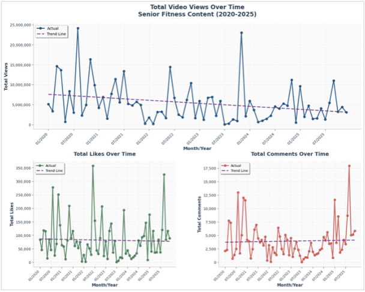
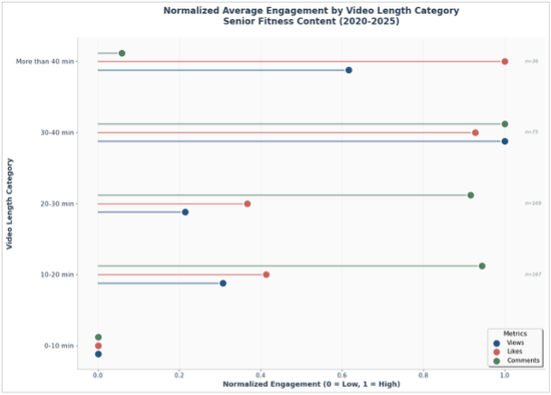
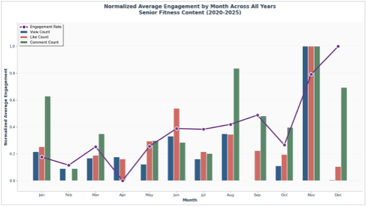
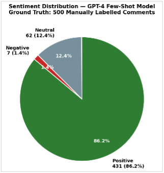
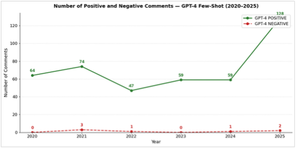
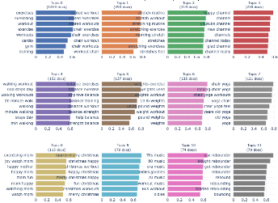
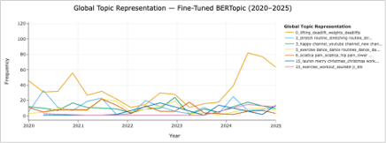

# 📺🏃‍♀️ YouTube Senior Fitness Analytics: Sentiment Analysis and Topic Modelling

This study analyses **31,650 viewer comments** from **521 senior fitness videos** across **137 YouTube channels** (2020-2025) to help content creators understand audience feedback at scale. It combines exploratory data analysis, GPT-4 sentiment classification, and fine-tuned BERTopic topic modelling to transform unstructured YouTube comments into actionable content strategy insights.

---

## 🏷️ Business Context

Senior fitness content on YouTube has grown significantly since the Covid-19 pandemic, yet most creators still rely on basic engagement metrics (views, likes, comments) to guide content decisions. Comment sections contain rich qualitative signals about viewer satisfaction, unmet needs, and health concerns, but the informal language, spelling errors, and volume of comments make manual analysis impractical at scale.

This study addresses that gap by building a scalable NLP pipeline that surfaces recurring themes and sentiment patterns from viewer comments, enabling evidence-based content decisions without requiring manual review.

---

## 🗂️ Dataset

Data was collected via the **YouTube Data API** using search terms centred on "Senior Fitness" and related phrases. Videos were filtered to exclude YouTube Shorts and non-exercise content.

- **Videos**: 521 senior fitness videos
- **Channels**: 137 unique YouTube channels
- **Comments**: 31,650 viewer comments (after pre-processing)
- **Period**: January 2020 to December 2025
- **Variables**: Video metadata (title, views, likes, comments, duration, tags, captions, quality) + channel-level data + viewer comments

---

## 📋 Executive Summary

**Exploratory Data Analysis**
- Videos of 30-40 minutes generate the highest engagement across all metrics (views, likes, comments)
- November is the peak engagement month; February consistently underperforms
- Content quality and algorithm alignment drive performance more than posting frequency
- HD video and captioned content attract significantly higher average views
- Content production surged in 2025 but did not translate into proportional engagement, suggesting market saturation

**Sentiment Analysis**
- GPT-4 with few-shot prompting achieved **93.4% accuracy**, outperforming GPT-3.5 zero-shot (92.4%) and VADER (87.0%)
- **86.2%** of comments are positive (gratitude, instructor loyalty, milestone celebrations)
- **12.4%** neutral (orientation questions from first-time viewers)
- **1.4%** negative (pacing, music volume, exercise accessibility)
- Neutral comments are the most actionable signal, reflecting unmet viewer needs

**Topic Modelling**
- Fine-tuned BERTopic reduced 240 fragmented baseline topics to **49 coherent themes** (Cv coherence: 0.611)
- Themes grouped into 4 categories: Popular Exercise Types, Engagement and Community, Health Conditions, and Global and Cultural
- Chair-based workouts, balance exercises, and stretching are the most discussed exercise formats
- A multilingual audience (Hindi, Filipino) is actively engaged but largely unaddressed by creators

> **Business Takeaway**: Creators should focus on 30-40 minute chair-based and stretching content, publish in November, add captions, and build community through instructor connection and milestone acknowledgement. Negative comments, though rare, are specific and fixable.

---

## ⚙️ Tools and Libraries

- **Language**: Python
- **Data Collection**: YouTube Data API v3
- **Sentiment Analysis**: OpenAI API (GPT-3.5 Turbo, GPT-4), VADER (nltk)
- **Topic Modelling**: BERTopic, sentence-transformers (all-mpnet-base-v2), UMAP, HDBSCAN, KeyBERTInspired
- **NLP Pre-processing**: nltk, contractions, re
- **Analysis and Visualisation**: Pandas, NumPy, Matplotlib, Seaborn, WordCloud, Scikit-learn

---

## 🗃️ Project Structure

- `data/` — Raw and pre-processed comment and video datasets (.csv)
- `notebooks/` — Jupyter notebooks for each pipeline stage (.ipynb)
  - `01_data_collection.ipynb`
  - `02_eda.ipynb`
  - `03_sentiment_analysis.ipynb`
  - `04_topic_modelling.ipynb`
- `visuals/` — Charts, word clouds, confusion matrices, topic visualisations

---

## 📈 Visualisations

### Engagement Analysis

> All three engagement metrics peaked during the early Covid-19 period (Aug-Sep 2020) and show a sustained downward trend since, despite content production increases in 2025.

> 30-40 minute videos consistently achieve the highest normalised engagement across views, likes, and comments.

> November peaks across all engagement metrics; February is the consistent low point across all years.

### Sentiment Analysis

> GPT-4 few-shot results: 86.2% positive, 12.4% neutral, 1.4% negative.

> Positive sentiment has increased over 2020-2025, with a notable spike in 2025 aligned with the content production surge.

### Topic Modelling

> Top 24 topics from the fine-tuned BERTopic model, showing semantically coherent clusters across exercise types and viewer concerns.

> Most topics maintained stable engagement from 2020-2023; strength and lifting topics surged from 2024, and health-condition topics show gradual upward trends.

---

## 🔍 Methodology

### Data Pre-Processing (Sentiment Analysis)
- Removed non-English comments and empty entries
- Corrected encoding errors (e.g., `&#39;s`)
- Removed emojis, HTML tags, URLs, @mentions, and hashtags

### Data Pre-Processing (Topic Modelling)
- Expanded contractions
- Removed stop words (nltk + custom domain-specific list)
- Stripped punctuation and lowercased all text
- Tokenised comments

### Sentiment Analysis Pipeline
- **Baseline**: GPT-3.5 zero-shot vs VADER evaluated against 500 manually labelled ground truth comments
- **Improved model**: GPT-4 with 2 few-shot examples per class (positive, neutral, negative), anchored to senior fitness language register
- Evaluated on overall accuracy and per-class F1-score (sklearn classification report)

### Topic Modelling Pipeline
- **Baseline BERTopic**: Default settings, generated 240 fragmented topics (outlier rate 33.7%)
- **Fine-tuned BERTopic**: Four enhancements applied
  - Comments filtered to more than 10 words (10,186 retained from 31,650)
  - N-gram range extended to capture phrases like "knee pain" and "chair yoga"
  - Embedding model upgraded to `all-mpnet-base-v2`
  - KeyBERTInspired representation model for sharper topic labels
- Fine-tuned model: 49 coherent topics, Cv coherence 0.611, outlier rate 57.3%

---

## 🎯 Key Results

| Model | Accuracy | Positive F1 | Neutral F1 | Negative F1 |
|---|---|---|---|---|
| VADER | 87.0% | 0.93 | 0.44 | 0.29 |
| GPT-3.5 Zero-shot | 92.4% | 0.96 | 0.57 | 0.29 |
| GPT-4 Few-shot | 93.4% | 0.96 | 0.72 | 0.46 |

| BERTopic Model | Topics | Outlier Rate | Cv Coherence |
|---|---|---|---|
| Baseline | 240 | 33.7% | N/A (fragmented) |
| Fine-tuned | 49 | 57.3% | 0.611 |

---

## 💡 Key Recommendations for Senior Fitness Creators

**Make Content Findable**: Use task-based keywords in titles (e.g., "Stretching Routine", "Chair Workout"). Post monthly; publish in November and avoid February.

**Design for the Senior Body**: Target 30-40 minute sessions. Prioritise chair workouts, balance exercises, and stretching. Reduce pacing on complex sequences and lower background music volume.

**Build Community**: Acknowledge viewer milestones publicly. Maintain a consistent, supportive instructor persona. Incorporate 70s and 80s music, a recurring engagement theme. Create a "Start Here" playlist to address the 12.4% of neutral orientation questions.

**Address Health Needs Responsibly**: Build condition-specific playlists for knee pain, blood sugar management, COPD, and long Covid recovery with appropriate safety disclaimers. Add Hindi and Filipino subtitles to serve the multilingual audience identified in the Global and Cultural topic category.

---

## 🚫 Limitations

- Ground truth sample of 500 comments represents only 1.6% of the full corpus; negative class metrics (only 6 negative examples) carry high statistical uncertainty
- Data collected in a single search session, reflecting one instance of YouTube's personalised ranking
- English-only comment filtering limits generalisability to the multilingual audience
- The 57.3% outlier rate in fine-tuned BERTopic means findings reflect 43% of the comment corpus
- Automated text analysis cannot capture clinical context; health-related insights are directional only

---

## 🌟 Future Work

- Cross-platform validation on TikTok and Instagram Reels
- Longitudinal tracking with quarterly retraining on new comments
- Collaboration with physiotherapists to validate health condition recommendations
- Offline viewer surveys to validate findings beyond the self-selected commenting population
- Expanding the negative sentiment ground truth to at least 35-50 examples for more reliable minority class evaluation
